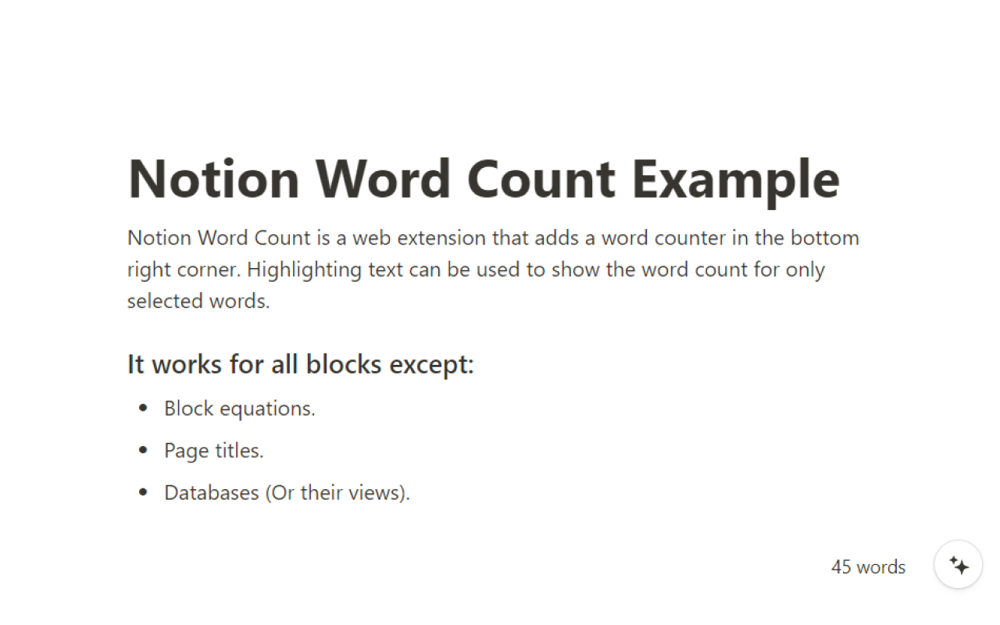
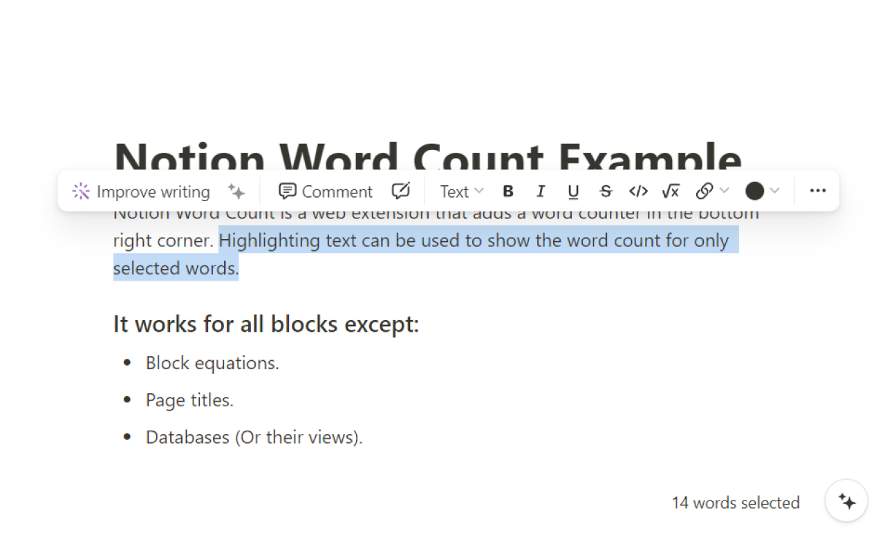
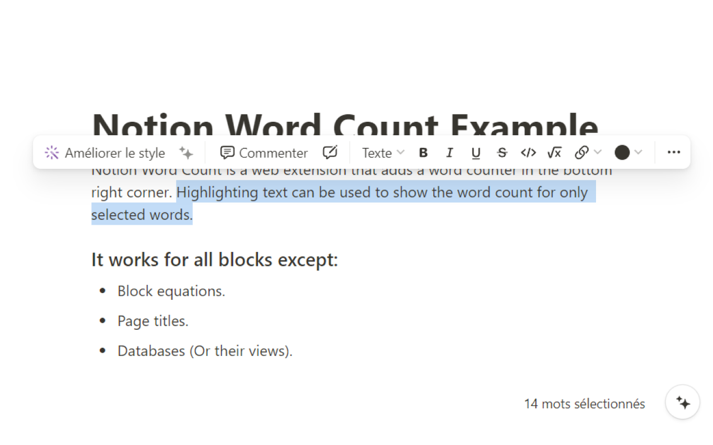

This is a browser extension that adds a word count to the **bottom right corner** of the web version of [Notion](https://www.notion.so/). Highlighting text will only show the word count for the selected text.

| Default | Selecting |
| ------- | --------- |
|  |  | 


## 🌐 Internationalisation

This extension is currently available in **English** and **French**. You can add more languages by creating a pull request translating the [two lines here](./src/i18n/translations.ts).

Your preferred language is **automatically** determined by first checking the language set in Notion and then checking your browser languages until a supported language is found. If no supported language is found, it will default to English.



## 🔨 Development

You can build the extension in it's unpacked form for local development using either:
* `npm run build:chrome`.
* `npm run build:firefox`.

To watch for changes to the `css` or `ts` files, you can use:
* `npm run dev:chrome`.
* `npm run dev:firefox`.
> [!NOTE]
> This does not listen to changes in the manifest files or assets. If these change you will need to re-run the command.

## 🚀 Release

You can make a new release of the extension by using one of the following commands:
```sh
npm run release:patch
npm run release:minor
npm run release:majot
```

Each does a respective version update, builds the code, and creates a release zip file for each of the distributions in the `release` folder. It then creates a commit with all the updated files and tags it with the new version before pushing it to GitHub.

## 💌 Acknowledgements

A big thank you to [Notion](https://www.notion.so/) for creating something worth making this for 💖.